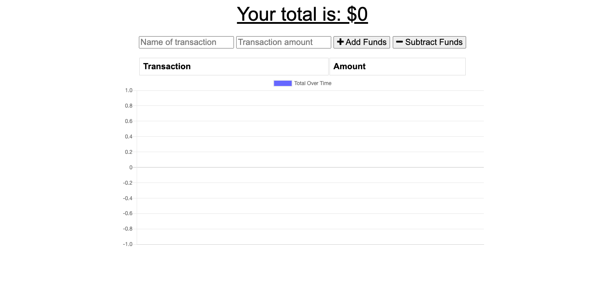

# What's My Budget

## Description
### This is an app for users to keep track of their budget and transactions while on the go. Users can add an expense or a deposit. If the user happens to lose internet connection the app still interacts with them and saves their data. Once back online the data is updated and saved for the user. The application can be downloaded to the user's desktop or homescreen of their phone.

## Installation
- Node.js
- Express
- MongoDB

## Link to application
[Track your budget](https://guarded-thicket-41433.herokuapp.com)

## Screenshot of application
